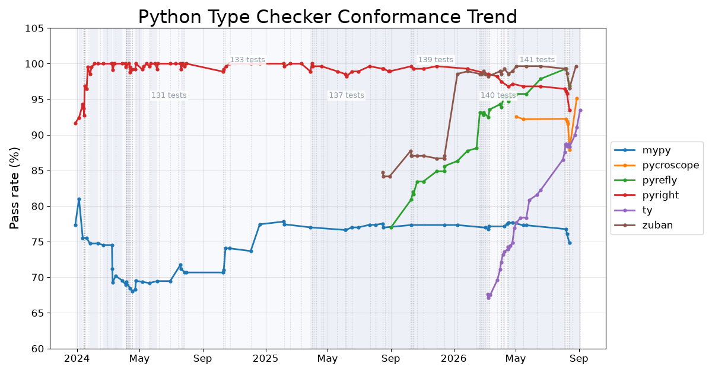

# Typing Conformance Trend

An interactive trend chart showing how well popular Python type checkers conform to the official
[Python typing specification conformance test suite](https://github.com/python/typing/blob/main/conformance/results/results.html) over time.

**[View the live chart](https://driftcell.github.io/typing-conformance-trend/)**

Each line is one type checker (mypy, pyright, ty, zuban, pyrefly, …). Hover a point to see the exact checker version, pass rate, and the commit it came from; click legend entries to toggle lines; drag to zoom.

## How the data is built

- Source: the full git history of
  [`conformance/results/results.html`](https://github.com/python/typing/commits/main/conformance/results/results.html) in [python/typing](https://github.com/python/typing).
- X axis: commit date. Y axis: pass rate (%).
- A point is added whenever a checker's version or pass rate changes (within a day, the latest commit wins), so flat segments stay clean.
- Pass rate = (Pass + 0.5 × Partial) / total tests, matching the suite's own scoring convention.
- The test suite itself grows over time (from 42 to 145+ tests): shaded background bands mark the periods with a constant number of tests, so pass rates across band boundaries are not strictly comparable.
- Test files are also edited in place without changing the test count (assertions relaxed or tightened, expectations clarified) — in fact far more often than the suite grows. These edits are detected via the git tree hash of [`conformance/tests`](https://github.com/python/typing/tree/main/conformance/tests) at every published run and drawn as dotted vertical lines; pass rates across such a line are not strictly comparable either. Hover a point on a marked run to see the edit's commit messages.

The chart is regenerated and republished automatically every Monday (UTC) via GitHub Actions.
